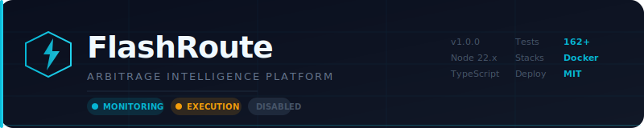
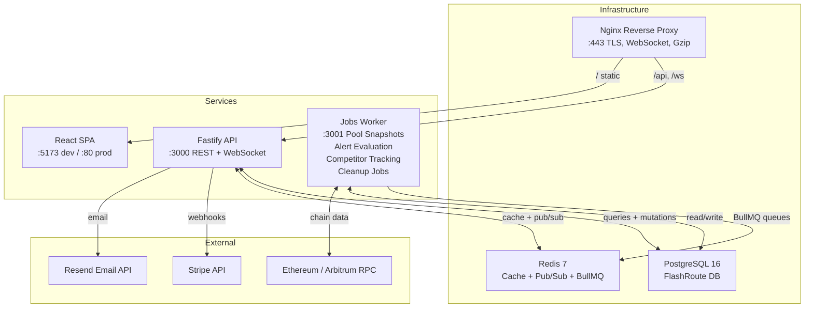

# FlashRoute

<div align="center">



**Real-time DeFi arbitrage intelligence and analytics for traders and funds.**

[](https://github.com/Discovery099/flashroute/actions)
[](LICENSE)
[](https://nodejs.org)
[](https://www.typescriptlang.org)
[](https://github.com/Discovery099/flashroute/actions)
[](CONTRIBUTING.md)
[](https://github.com/Discovery099/flashroute/stargazers)
[](https://github.com/Discovery099/flashroute/network/members)

</div>

---

## Table of Contents

- [What is FlashRoute?](#what-is-flashroute)
- [Features](#-features)
- [Architecture](#-architecture)
- [Tech Stack](#-tech-stack)
- [Quick Start](#-quick-start)
- [Screenshots](#-screenshots)
- [Built With](#-built-with)
- [Documentation](#-documentation)
- [Security](#-security)
- [Contributing](#-contributing)
- [License](#-license)

---

## What is FlashRoute?

FlashRoute is a **monitoring-first DeFi arbitrage SaaS** — it watches DEX pools across Ethereum and Arbitrum, identifies multi-hop arbitrage paths, predicts profitability with ML-assisted demand forecasting, and simulates trade outcomes. When you're ready, it can execute trades through a configurable hot-wallet model with granular safety controls.

> ⚠️ **Execution is disabled by default.** The platform runs in monitoring-only mode out of the box. You can evaluate the feeds, configure strategies, and analyze historical performance before ever enabling trade execution.

---

## 🔥 Features

| Feature | Description |
|---------|-------------|
| **Live Opportunity Feed** | Real-time arbitrage opportunity stream across Uniswap v2/v3, Sushiswap, and more — via WebSocket with automatic reconnection |
| **Route Discovery** | Multi-hop arbitrage path finding between arbitrary token pairs |
| **Demand Prediction** | ML-assisted profit forecasting trained on historical execution data |
| **Profit Simulation** | Sandboxed profitability modeling — gas, slippage, flash loan fee, net P&L — before any capital is committed |
| **Strategy Management** | Per-strategy min profit threshold, max gas price, hop limits, DEX allowlist, risk buffer |
| **Trade Analytics** | Full P&L attribution, route breakdown, gas efficiency analysis, trend charts |
| **Configurable Alerts** | Gas spike, profit threshold, trade confirmation — email and webhook delivery |
| **Subscription Billing** | Stripe-powered tiered plans — Monitor, Trader, Executor, Institutional |
| **Admin Controls** | System health dashboard, user management, impersonation, config hot-reload |
| **Operator Safety** | Execution pause/resume, unhealthy chain detection, max concurrent execution limits |

---

## 🏗️ Architecture



### Service Responsibilities

| Service | Role |
|---------|------|
| **Fastify API** | Auth, strategy CRUD, trade history, billing webhooks, admin controls, dashboard aggregation |
| **React SPA** | All user-facing UI — opportunities, strategies, analytics, billing, admin |
| **Jobs Worker** | Scheduled jobs — pool snapshot capture, competitor tracking, alert evaluation, data retention |
| **PostgreSQL** | Primary data store — users, strategies, trades, audit logs, subscriptions |
| **Redis** | Session cache, opportunity cache, BullMQ job queue backend, pub/sub for live updates |

---

## ⚡ Tech Stack

| Layer | Technology |
|-------|------------|
| **Frontend** | React 18 · React Router 7 · TanStack Query v5 · Zustand · Tailwind CSS · Recharts |
| **API** | Fastify v5 · TypeScript 5 · Prisma ORM · Zod validation |
| **Database** | PostgreSQL 16 |
| **Cache / Queue** | Redis 7 · BullMQ |
| **Blockchain** | JSON-RPC · WebSocket subscriptions · ethers.js v6 |
| **Auth** | JWT (access + refresh) · bcrypt · TOTP 2FA |
| **Billing** | Stripe (subscriptions + webhooks) |
| **Deployment** | Docker Compose · Nginx · GitHub Actions CI/CD |

---

## 🚀 Quick Start

### Prerequisites

- **Node.js** 22.x
- **pnpm** 9.x (`npm i -g pnpm`)
- **Docker** and **Docker Compose** v2

### 1. Clone and Setup

```bash
git clone https://github.com/Discovery099/flashroute.git
cd flashroute
node setup.js
```

The wizard will check prerequisites, create your `.env`, install dependencies, and start PostgreSQL + Redis.

### 2. Configure Environment

```bash
cp .env.example .env
# Open .env and update the required values:
#   - JWT_ACCESS_SECRET, JWT_REFRESH_SECRET, COOKIE_SECRET, ENCRYPTION_KEY
#     Generate with: openssl rand -base64 48
```

For local development, only `DATABASE_URL` and `REDIS_URL` are required to be real connections. All auth secrets can be development values.

### 3. Start Infrastructure

```bash
docker compose up -d postgres redis
```

### 4. Install Dependencies and Migrate

```bash
pnpm install
pnpm --filter @flashroute/db migrate deploy
```

### 5. Start Development Servers

```bash
# Terminal 1 — API (port 3000)
pnpm --filter @flashroute/api dev

# Terminal 2 — Frontend (port 5173)
pnpm --filter @flashroute/web dev

# Terminal 3 — Jobs Worker (port 3001)
pnpm --filter @flashroute/jobs-worker dev
```

### 6. Open the App

```
http://localhost:5173
```

Register a new account. By default you start on the **Monitor** plan — full access to live opportunities, strategies, and analytics. Upgrade to **Trader** or **Executor** to enable trade execution (disabled by default).

---

## 📸 Screenshots

> Screenshots coming soon — the platform is production-ready but UI screenshots need to be captured in a clean environment.

| Page | Description |
|------|-------------|
|  | Dashboard with live KPI cards, profit trend chart, recent trades |
|  | Live opportunity feed with chain filter, profit sorting, expiry indicators |
|  | Strategy creation with DEX allowlist, gas limits, risk buffer |
|  | Analytics with profit/volume trends, success rate, gas efficiency |
|  | Subscription management with plan comparison and upgrade flow |

---

## 🛠️ Built With

<div align="center">

| Technology | Badge |
|------------|-------|
| React |  |
| TypeScript |  |
| Fastify |  |
| PostgreSQL |  |
| Redis |  |
| TanStack Query |  |
| Docker |  |
| Nginx |  |
| Stripe |  |
| Node.js |  |
| Tailwind CSS |  |
| Zustand |  |

</div>

---

## 📖 Documentation

| Guide | What You'll Learn |
|-------|-------------------|
| **[Operator Setup](docs/operator-setup.md)** | Prerequisites, full production deployment checklist, Stripe wiring, first admin user |
| **[Setup Guide](SETUP-GUIDE.md)** | Step-by-step local dev setup, environment variables, database migrations, service management |
| **[Environment Reference](docs/environment-reference.md)** | Every env var documented — grouped by domain with examples |
| **[Execution Safety](docs/execution-safety.md)** | What FlashRoute does/doesn't guarantee, wallet model, safe execution enablement order, failure modes |
| **[Admin Runbook](docs/runbooks/admin-runbook.md)** | User management, health states, config changes, quick actions, billing operations |
| **[Incident Response](docs/runbooks/incident-response.md)** | 10 incident categories, severity levels, symptoms, containment, recovery, post-incident steps |

---

## 🔒 Security

**Execution is disabled by default.** The platform operates in monitoring-only mode until you explicitly enable it.

Before enabling execution, read the [Execution Safety Guide](docs/execution-safety.md) — it covers:
- The hot-wallet model and key isolation
- Safe enablement sequence (4-phase rollout)
- Execution pause and resume controls
- Failure mode taxonomy and emergency actions

**Report security vulnerabilities**: Please do not open public issues for security concerns. Reach out directly with details.

---

## 🤝 Contributing

Contributions are welcome. Please read [CONTRIBUTING.md](CONTRIBUTING.md) before opening a PR.

- Fork the repo and create a feature branch
- Run `pnpm typecheck && pnpm lint && pnpm test` before pushing
- Follow [Conventional Commits](https://www.conventionalcommits.org/) for commit messages
- PRs must pass CI and require review before merge

---

## ⭐ Star History

[](https://star-history.com/#Discovery099/flashroute&Date)

---

## 📄 License

FlashRoute is open source under the [MIT License](LICENSE). You can use, modify, and distribute it freely with attribution.
